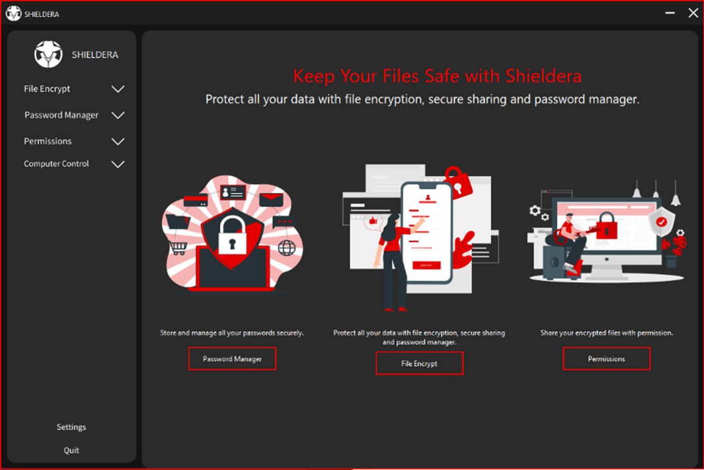
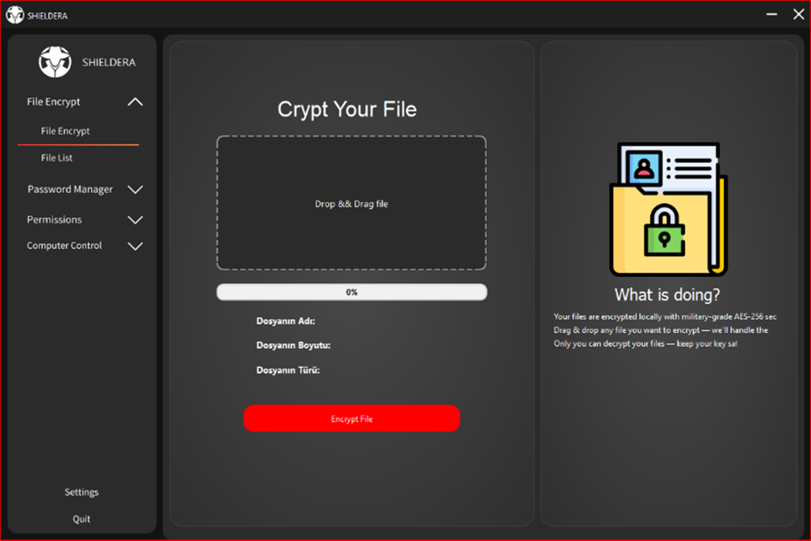
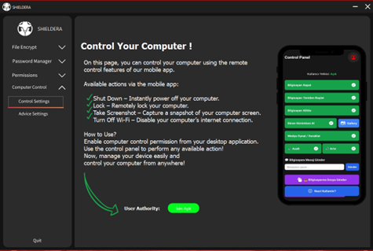
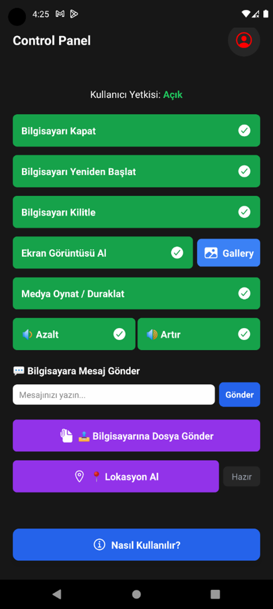

# Shieldera-Python-Pyside6-DesktopApp
Shieldera | Güvenlik Uygulaması | Python Pyside6 PyQt

# SHIELDERA

**Bitirme Projesi – Masaüstü ve Mobil Uygulama**

SHIELDERA, kullanıcıların dosya güvenliği, parola yönetimi ve uzaktan bilgisayar kontrolü gibi ihtiyaçlarını karşılamak üzere geliştirilen bir masaüstü ve mobil uygulama projesidir. Üniversite bitirme projesi kapsamında geliştirilmiş bu uygulama, hem masaüstü (Python + PySide6) hem de mobil (React Native) ortamda çalışmaktadır.

---

## 🖥️ Masaüstü Uygulama (Python + PySide6)

  
  
  

---

## 📱 Mobil Uygulama (React Native)

  
  

---

## 🔐 SHIELDERA Projesi – Temel Modüller ve Özellikler

### 1. Temel Modüller

#### Dosya Şifreleme ve Paylaşım
- Kullanıcı tarafından yüklenen dosyalar **AES-256** algoritması ile şifrelenir.
- Şifreli dosyalar yalnızca yetkilendirilmiş kullanıcılar arasında paylaşılabilir.
- Dosya erişimi, kullanıcı bazlı izin sistemine dayanır.

#### Parola Yöneticisi
- Tüm hesap bilgileri güvenli biçimde saklanır.
- Mobil ve masaüstü arayüzlerinden erişim mümkündür.
- Güçlü parola üretme ve düzenleme desteklenir.

### 2. Uzaktan Bilgisayar Kontrol Modülü (Mobil Uygulama Üzerinden)
- Bilgisayarı kapatma
- Bilgisayarı yeniden başlatma
- Bilgisayarı kilitleme
- Ekran görüntüsü alma
- Ses seviyesini artırma/azaltma
- Medya oynatma/durdurma kontrolü
- Bilgisayarın coğrafi konumunu bulma
- Telefondan girilen kısa mesajı bilgisayarda gösterme

### 3. Teknik Altyapı ve Entegrasyon
- **Masaüstü**: Python + PySide6
- **Mobil**: React Native
- **Veri Yönetimi & Senkronizasyon**: Firebase
- **Şifreleme**: AES, SHA-256 kriptografi kütüphaneleri
